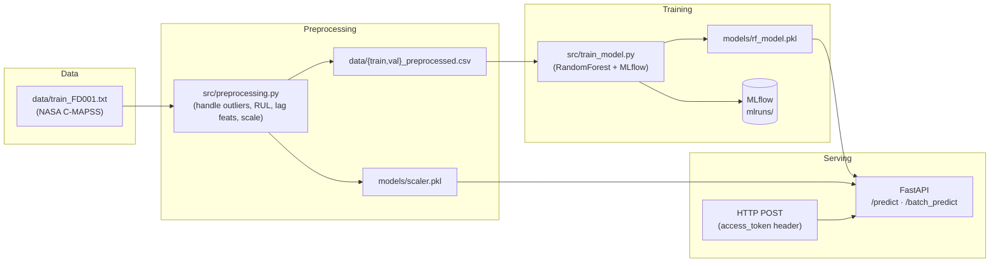

# predictive-maintenance

A FastAPI service that predicts the **Remaining Useful Life (RUL)** of
turbofan engines from sensor telemetry. Training uses the NASA **C-MAPSS**
degradation dataset; serving is a standalone Python API with single and
batch prediction endpoints.

> **Status:** portfolio project. Training + preprocessing + serving work
> end-to-end once the dataset is in `data/`. Rolling cleanup underway —
> see [Roadmap](#roadmap).

## Architecture



## What's in the box

| Layer | Tech |
|---|---|
| API | FastAPI 0.115 + Pydantic v2 |
| Auth | API key via `access_token` header |
| Model | `RandomForestRegressor` (scikit-learn 1.5) |
| Tracking | MLflow 2.17 |
| Packaging | `requirements.txt` / `requirements-dev.txt` |

## Quickstart

```bash
# 1. Clone and install
git clone https://github.com/rRexhepi/predictive-maintenance.git
cd predictive-maintenance
python3 -m venv venv
source venv/bin/activate          # or venv\Scripts\activate on Windows
pip install -r requirements-dev.txt

# 2. Drop the C-MAPSS dataset into data/
#    See data/README.md for links.

# 3. Preprocess + fit the scaler
python src/preprocessing.py

# 4. Train the model (logs the run via MLflow; see below)
python src/train_model.py

# 5. Serve
export API_KEY="$(python -c 'import secrets;print(secrets.token_urlsafe(32))')"
uvicorn src.api.main:app --reload

# 6. Try it
curl -X POST http://127.0.0.1:8000/predict \
  -H "Content-Type: application/json" \
  -H "access_token: $API_KEY" \
  -d '{"feature1": 0.5, "feature2": 1.2, "feature3": 3.4}'
```

FastAPI exposes Swagger UI at <http://127.0.0.1:8000/docs> and ReDoc at
<http://127.0.0.1:8000/redoc>.

## MLflow

`src/train_model.py` currently expects a running MLflow tracking server
at `http://localhost:5001`. Start one before training:

```bash
mlflow server \
  --backend-store-uri sqlite:///mlflow.db \
  --default-artifact-root mlruns \
  --host 0.0.0.0 \
  --port 5001
```

Moving to a file-store default (so training works without a long-running
server) is on the [Roadmap](#roadmap).

## Endpoints

### `POST /predict`

Single-row prediction.

**Headers:** `Content-Type: application/json`, `access_token: <API_KEY>`

**Body:**
```json
{"feature1": 0.5, "feature2": 1.2, "feature3": 3.4}
```

**Response:** `{"predicted_rul": 15.2}`

### `POST /batch_predict`

Batch prediction.

**Body:**
```json
{"data": [
  {"feature1": 0.5, "feature2": 1.2, "feature3": 3.4},
  {"feature1": 0.6, "feature2": 1.3, "feature3": 3.5}
]}
```

**Response:** `{"predictions": [15.2, 23.5]}`

## Tests

Once the test suite lands (see [Roadmap](#roadmap)):

```bash
pytest
```

## Known gaps (being worked on)

This repo is mid-cleanup. Honest about what isn't there yet:

- **API schema is placeholder.** `PredictRequest` still has `feature1/2/3`
  fields; the actual trained model consumes the full C-MAPSS sensor +
  lag feature set. API and model are out of sync until the schema is
  regenerated from the training columns.
- **`/predict` does disk I/O per request.** The handler writes the input
  to a CSV, runs `clean_input_data`, reads it back, then deletes. That's
  a race condition waiting for concurrent traffic. In-memory refactor is
  the next PR.
- **No Dockerfile.** Packaging PR is on deck.
- **No CI / tests.** Coming.

## Roadmap

What a reviewer would expect from a "production-style ML serving"
portfolio project, and what's next:

- [x] `requirements.txt` + `requirements-dev.txt`
- [x] Cleaned `.gitignore` (was globally ignoring `*.txt` and `*.yaml`, blocking itself)
- [x] `data/` and `models/` README pointers; artifacts gitignored
- [x] Untrack `mlflow.db` (was committed)
- [ ] Kill disk-I/O in `/predict`; clean in-memory
- [ ] Lifespan event handler (current `@app.on_event` is deprecated)
- [ ] Dockerfile + `docker-compose.yaml`
- [ ] GitHub Actions CI: lint + pytest
- [ ] Endpoint tests (happy path + 403 on bad key + 422 on bad payload)
- [ ] Move MLflow tracking URI to env var with file-store default
- [ ] MLflow Model Registry with `@candidate`/`@production` aliases + pyfunc serving
- [ ] Cap `n_jobs` default (currently `-1`; fork-bombs laptops)
- [ ] Regenerate API schema from training feature columns
- [ ] Prometheus `/metrics` endpoint
- [ ] Provisioned Grafana dashboard
- [ ] CI workflow that captures the dashboard screenshot via Playwright

## License

MIT — see [LICENSE](LICENSE).
