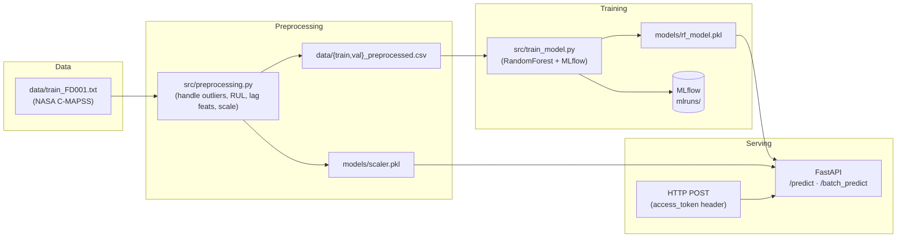

# predictive-maintenance

A FastAPI service that predicts the **Remaining Useful Life (RUL)** of
turbofan engines from sensor telemetry. Training uses the NASA **C-MAPSS**
degradation dataset; serving is a standalone Python API with single and
batch prediction endpoints.

> **Status:** portfolio project. Training + preprocessing + serving work
> end-to-end once the dataset is in `data/`. Rolling cleanup underway —
> see [Roadmap](#roadmap).

## Architecture



## What's in the box

| Layer | Tech |
|---|---|
| API | FastAPI 0.115 + Pydantic v2 |
| Auth | API key via `access_token` header |
| Model | `RandomForestRegressor` (scikit-learn 1.5) |
| Tracking | MLflow 2.17 |
| Packaging | `requirements.txt` / `requirements-dev.txt` |

## Quickstart

```bash
# 1. Clone and install
git clone https://github.com/rRexhepi/predictive-maintenance.git
cd predictive-maintenance
python3 -m venv venv
source venv/bin/activate          # or venv\Scripts\activate on Windows
pip install -r requirements-dev.txt

# 2. Drop the C-MAPSS dataset into data/
#    See data/README.md for links.

# 3. Preprocess + fit the scaler
python src/preprocessing.py

# 4. Train the model (logs the run via MLflow; see below)
python src/train_model.py

# 5. Serve
export API_KEY="$(python -c 'import secrets;print(secrets.token_urlsafe(32))')"
uvicorn src.api.main:app --reload

# 6. Try it
curl -X POST http://127.0.0.1:8000/predict \
  -H "Content-Type: application/json" \
  -H "access_token: $API_KEY" \
  -d '{"feature1": 0.5, "feature2": 1.2, "feature3": 3.4}'
```

FastAPI exposes Swagger UI at <http://127.0.0.1:8000/docs> and ReDoc at
<http://127.0.0.1:8000/redoc>.

## Docker

```bash
# Train artifacts first (the image mounts ./models read-only)
make preprocess && make train

export API_KEY="$(python -c 'import secrets;print(secrets.token_urlsafe(32))')"
make docker-build
make docker-up

curl -fsS http://localhost:8000/health
```

`docker-compose.yaml` mounts `./models:/app/models:ro` so a retrain
outside the container is picked up on the next restart without rebuilding
the image. `API_KEY` is required — the compose file fails fast if it's
unset rather than letting the API boot with no auth.

## MLflow Model Registry

`src/train_model.py` wraps training in `mlflow.start_run()`, logs a
single **pyfunc** artifact (scaler + estimator wrapped as
`PredictiveMaintenanceModel`), and registers it under the name
`predictive-maintenance-rul`. Every new version gets the `@candidate`
alias; passing `--promote` also moves the `@production` alias.

```bash
python src/train_model.py             # register as @candidate
python src/train_model.py --promote   # also promote to @production
mlflow ui                              # browse runs + registry at http://localhost:5000
```

Serving resolves either path:

```bash
# Registry path (production).
MODEL_URI=models:/predictive-maintenance-rul@production make serve

# Filesystem path (local dev / CI / Dockerfile default).
make serve   # falls back to models/rf_model.pkl + models/scaler.pkl
```

`MLFLOW_TRACKING_URI` defaults to the file backend `file:./mlruns` — no
long-running tracking server required for local iteration. Point it at
an HTTP backend (`http://localhost:5001` etc.) when you want the UI.
`PM_N_JOBS` caps sklearn's joblib fan-out (default 2; crank higher if
you have the cores).

## Endpoints

### `POST /predict`

Single-row prediction.

**Headers:** `Content-Type: application/json`, `access_token: <API_KEY>`

**Body:**
```json
{"feature1": 0.5, "feature2": 1.2, "feature3": 3.4}
```

**Response:** `{"predicted_rul": 15.2}`

### `POST /batch_predict`

Batch prediction.

**Body:**
```json
{"data": [
  {"feature1": 0.5, "feature2": 1.2, "feature3": 3.4},
  {"feature1": 0.6, "feature2": 1.3, "feature3": 3.5}
]}
```

**Response:** `{"predictions": [15.2, 23.5]}`

## Tests

```bash
make test
```

Covers:
- `Preprocessor`-style utility functions (drop/impute branches, no-mutation, file round-trip, `validate_data`, `save_predictions`).
- The FastAPI `/predict`, `/batch_predict`, and `/health` endpoints — happy paths, Pydantic 422s on bad payloads, 403 on missing / wrong API keys, empty-batch rejection, and a regression guard asserting no `temp_*.csv` files appear during a request.

CI runs ruff + pytest + a Docker image build on every push and pull request (see [`.github/workflows/ci.yml`](.github/workflows/ci.yml)).

## Known gaps (being worked on)

This repo is mid-cleanup. Honest about what isn't there yet:

- **API schema is placeholder.** `PredictRequest` still has `feature1/2/3`
  fields; the actual trained model consumes the full C-MAPSS sensor +
  lag feature set. API and model are out of sync until the schema is
  regenerated from the training columns.
- **`/predict` does disk I/O per request.** The handler writes the input
  to a CSV, runs `clean_input_data`, reads it back, then deletes. That's
  a race condition waiting for concurrent traffic. In-memory refactor is
  the next PR.
- **No Dockerfile.** Packaging PR is on deck.
- **No CI / tests.** Coming.

## Roadmap

What a reviewer would expect from a "production-style ML serving"
portfolio project, and what's next:

- [x] `requirements.txt` + `requirements-dev.txt`
- [x] Cleaned `.gitignore` (was globally ignoring `*.txt` and `*.yaml`, blocking itself)
- [x] `data/` and `models/` README pointers; artifacts gitignored
- [x] Untrack `mlflow.db` (was committed)
- [ ] Kill disk-I/O in `/predict`; clean in-memory
- [ ] Lifespan event handler (current `@app.on_event` is deprecated)
- [x] Dockerfile + `docker-compose.yaml`
- [x] GitHub Actions CI: lint + pytest + Docker build
- [x] Endpoint tests (happy path + 403 on bad key + 422 on bad payload)
- [x] Move MLflow tracking URI to env var with file-store default
- [x] MLflow Model Registry with `@candidate`/`@production` aliases + pyfunc serving
- [x] Cap `n_jobs` default (now 2; env-configurable via `PM_N_JOBS`)
- [ ] Regenerate API schema from training feature columns
- [ ] Prometheus `/metrics` endpoint
- [ ] Provisioned Grafana dashboard
- [ ] CI workflow that captures the dashboard screenshot via Playwright

## License

MIT — see [LICENSE](LICENSE).
